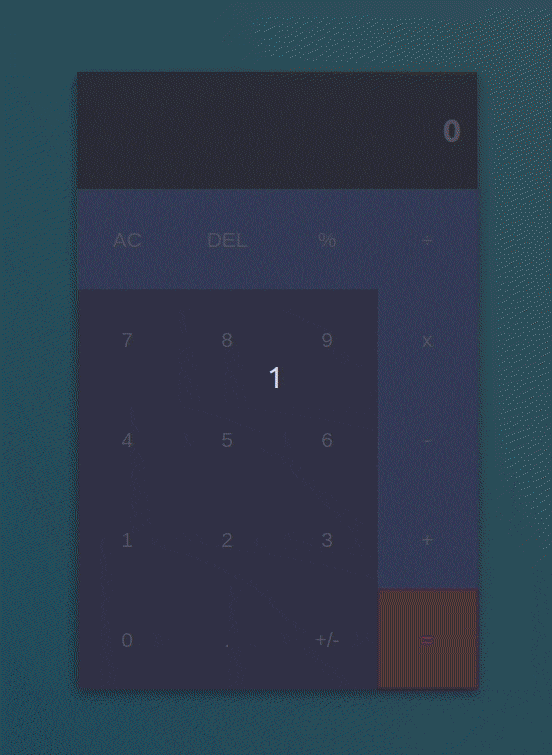

# Calculator App (React)

This project is one of the main projects found in the React and Redux curriculum at [Microverse](https://www.microverse.org/) - @microverseinc

The purpose is to create a Calculator app using React. The features of the app also include:

- Basic binary operations
- Calculations with big numbers

## Built With

- React
- Big.js

## Preview



## Live Demo

[Live link](https://ssf-calculator.netlify.com/).

## Getting Started

```bash
git clone git@github.com:Torres-ssf/react-calculator.git
```

### Prerequisites

- npm and yarn.

### Install

```bash
yarn install
```

### Usage

```bash
yarn start
```

### Deployment

```bash
yarn build
```

## Authors

👤 **Sérgio Torres**

- Github: [Torres-ssf](https://github.com/Torres-ssf)
- Twitter: [@torres_ssf](https://twitter.com/torres_ssf)
- Linkedin: [torres-ssf](https://www.linkedin.com/in/torres-ssf/)

## 🤝 Contributing

Contributions, issues and feature requests are welcome!

Feel free to check the [issues page](https://github.com/Torres-ssf/react-calculator/issues).

## Show your support

Give a ⭐️ if you like this project!

## 📝 License

This project is [MIT](./LICENSE) licensed.
